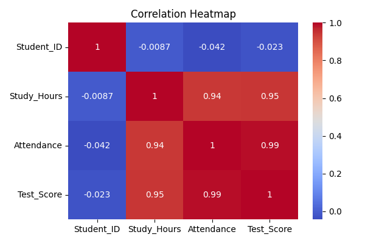
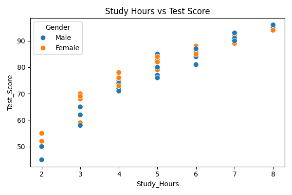
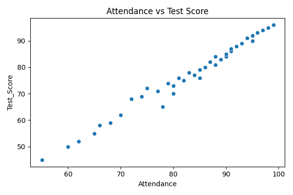

# 🎓 Student Performance Analysis

A beginner-friendly **Data Analytics project** that explores how factors like **study hours**, **attendance**, and **parental education** impact student test scores.  
The project uses **Python (Pandas, Matplotlib, Seaborn)** to perform data exploration, visualization, and correlation analysis.

---

## 📊 Project Overview

This project aims to answer:
- How do study hours affect student performance?
- Does attendance have a positive impact on test scores?
- How does parental education level correlate with student success?

The analysis helps visualize trends and relationships using charts and heatmaps, offering insights useful for educators and students alike.

---

## 🧩 Folder Structure


---

## 🧠 Key Insights

1️⃣ Study hours strongly correlate with higher test scores.  
2️⃣ Students with better attendance perform consistently well.  
3️⃣ Parental education positively impacts average scores.

---

## 🧾 Dataset Information

| Column Name        | Description |
|--------------------|-------------|
| **Student_ID**      | Unique ID for each student |
| **Gender**          | Male / Female |
| **Study_Hours**     | Number of hours studied per day |
| **Attendance**      | Percentage of attendance |
| **Parent_Education**| Highest education level of parents |
| **Test_Score**      | Final test score out of 100 |

📂 *Dataset Path:* `dataset/student_scores.csv`

---

## 📸 Screenshots

### 🔹 Correlation Heatmap


### 🔹 Study Hours vs Test Score


### 🔹 Attendance vs Test Score


### 🔹 Parent Education vs Test Score


---

## ⚙️ Tech Stack
- **Language:** Python 🐍  
- **Libraries Used:**
  - `pandas` → Data handling  
  - `matplotlib` → Visualization  
  - `seaborn` → Statistical plotting  

---

## 🧰 Installation & Setup

### Step 1: Clone this repository
```bash
git clone https://github.com/<your-username>/student-performance-analysis.git
cd student-performance-analysis

```
### Step 2: Create virtual environment (optional)
```bash
python -m venv env
env\Scripts\activate  # For Windows
```

### Step 3: Install dependencies
```bash
pip install pandas matplotlib seaborn
```

### Step 4: Run the analysis
```bash
python student_analysis.py
```

---

### Sample Output
1️⃣ Study hours correlate with test score: 0.87
2️⃣ Attendance correlates with test score: 0.76
3️⃣ Average test score: 78.2
✅ All plots saved in the 'charts/' folder.

---

### 🚀 Future Improvements

Add machine learning model to predict student scores

Include more features like age, class participation, and assignments completed

Build a simple dashboard (using Streamlit or Power BI)
